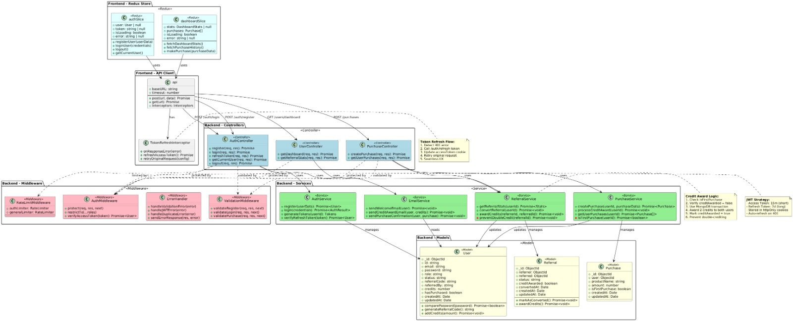
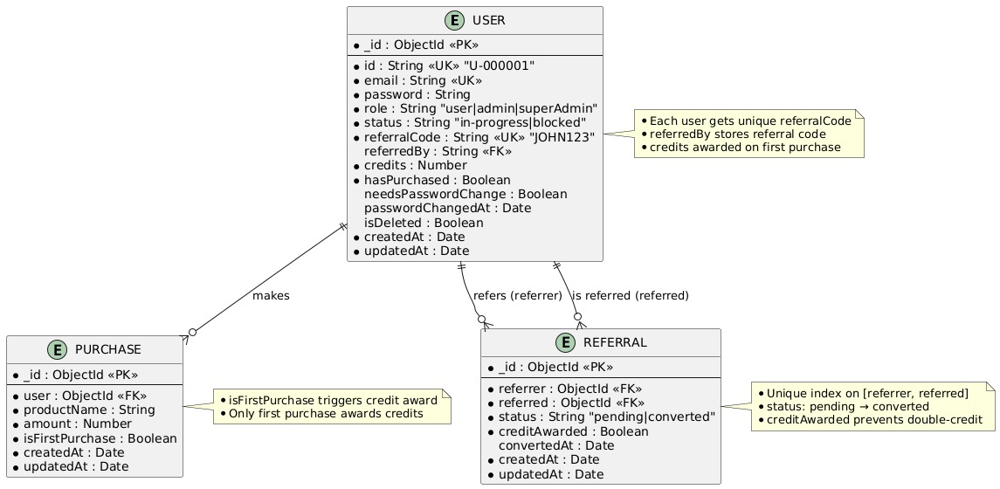

# FileSure Referral System - Architecture Documentation

### Complete System Architecture

This diagram shows the full system architecture with all layers, components, controllers, services, and data models.

The architecture follows a clean layered approach:
- **Frontend Layer**: Redux Store and API Client
- **Backend Controllers**: Token authentication, User, Purchase, Referral, and Dashboard controllers
- **Middlewares**: Auth, validation, and error handling
- **Services**: Business logic separated from controllers
- **Models**: User, Purchase, and Referral data models
- **Database**: MongoDB with proper relationships

### Database Schema (ER Diagram)

This Entity-Relationship diagram shows the database structure with all fields, relationships, and constraints.

Key relationships:
- **User** makes multiple **Purchases** (one-to-many)
- **User** refers other users through **Referral** (one-to-many as referrer)
- **User** is referred by one user through **Referral** (one-to-many as referred)

Important fields:
- `isFirstPurchase` triggers credit rewards
- `status: "pending|converted"` tracks referral conversion
- `creditAwarded` prevents double-crediting
- Unique indexes on `[referrer, referred]` ensure data integrity

## Key Design Decisions

### 1. Strict Credit Policy
- **Decision**: Only users who registered with a referral code receive credits on first purchase
- **Rationale**: Encourages referral program adoption and prevents gaming the system
- **Implementation**: Check `user.referredBy` before awarding credits

### 2. MongoDB Transactions
- **Decision**: Use MongoDB transactions for purchase operations
- **Rationale**: Ensure atomic credit updates (both buyer and referrer)
- **Trade-off**: Requires replica set (more complex setup)

### 3. JWT with Refresh Tokens
- **Decision**: Separate access tokens (10d) and refresh tokens (365d)
- **Rationale**: Balance security and user experience
- **Implementation**: Auto-refresh on token expiration

### 4. Email Notifications
- **Decision**: Send async email notifications after credit awards
- **Rationale**: Improve user engagement and transparency
- **Implementation**: Nodemailer with Gmail SMTP

### 5. Redux for State Management
- **Decision**: Use Redux Toolkit over Context API
- **Rationale**: Better DevTools, predictable updates, middleware support
- **Trade-off**: More boilerplate but better for complex state

### 6. Zod for Validation
- **Decision**: Use Zod over Joi or class-validator
- **Rationale**: TypeScript-first, type inference, smaller bundle size
- **Implementation**: Schema validation on all API routes

### 7. Next.js App Router
- **Decision**: Use App Router over Pages Router
- **Rationale**: Server Components, better performance, future-proof
- **Trade-off**: Newer API with fewer community examples

## Performance Optimizations

1. **Database Indexing**
   - Unique indexes on: `email`, `id`, `referralCode`
   - Compound index on: `referrer + referred` for referral queries

2. **Query Optimization**
   - Populate only required fields
   - Use lean queries where possible
   - Limit dashboard referral history

3. **Frontend Optimization**
   - Code splitting with dynamic imports
   - Image optimization with Next.js Image
   - Memoization of expensive computations

4. **Caching Strategy**
   - Browser caching for static assets
   - Server-side caching for dashboard stats (potential)
   - MongoDB query result caching

